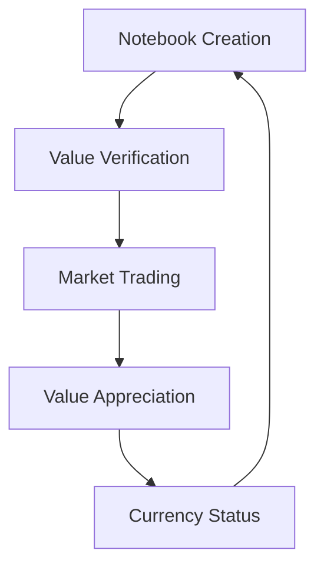

# 🎵 Conga

> The Future of Computational Currency: Why Notebooks Matter 🚀

## Why Notebooks Could Become Currency

### 1. Inherent Value Proposition

- **Executable Knowledge**: Unlike traditional digital assets, notebooks contain actual, runnable solutions
- **Practical Utility**: Each notebook solves real-world problems
- **Verifiable Output**: Results can be validated and reproduced
- **Composable Wealth**: Notebooks can be combined to create more valuable solutions

### 2. Market Dynamics

- **Supply & Demand**
  - Limited supply of high-quality solutions
  - Growing demand for automated data processing
  - Network effect of collaborative improvements
- **Value Storage**
  - Notebooks don't depreciate like traditional code
  - Can appreciate as they're refined and validated
  - Community contributions increase worth

### 3. Future Implications

## Why Conga is Positioned for This Future

1. **First-Mover Advantage**

   - Building infrastructure for notebook trading
   - Establishing value metrics
   - Creating market mechanisms

2. **BEAM/TigerBeetle Foundation**

   - Ready for high-frequency trading
   - Built-in double-entry accounting
   - Scalable for global adoption

3. **Community-Driven Value**
   - Collaborative improvements
   - Peer review system
   - Value consensus mechanisms

## The Vision

Imagine a future where:

- Data scientists trade solutions like stocks
- Companies maintain notebook portfolios
- Value is measured in practical impact
- Knowledge truly becomes liquid capital

---

_"In the future, the most valuable currency won't be Bitcoin – it'll be executable knowledge."_

## What's Cooking 🚀

- 📚 A marketplace for premium Livebook notebooks
- 💰 Secure notebook trading (powered by TigerBeetle)
- 🤝 Creator revenue sharing
- 🔄 Monthly subscriptions for power users
- ✨ Direct "Open in Livebook" integration

## Tech Stack

- Elixir/Phoenix (because concurrency is beautiful)
- Ash Framework (declarative power!)
- TigerBeetle (for rock-solid transactions)
- LiveView (keeping it real-time)
- Lots of ☕️

## Current Status

- [x] Core architecture
- [x] Basic marketplace flows
- [ ] Payment integration
- [ ] Creator dashboard
- [ ] Public beta

## Join the Journey

- 🐦 Follow progress: [@mburu_warui](https://twitter.com/your_handle)
- 💡 Share ideas: [GitHub Discussions](https://github.com/mburuwarui/conga/discussions)
- 🎯 Track progress: [GitHub Project](https://github.com/mburuwarui/conga)

## Let's Connect

Building this in public and would love your feedback. DMs are open!

---

Built with 💜 by [@mburu_warui](https://twitter.com/your_handle)
